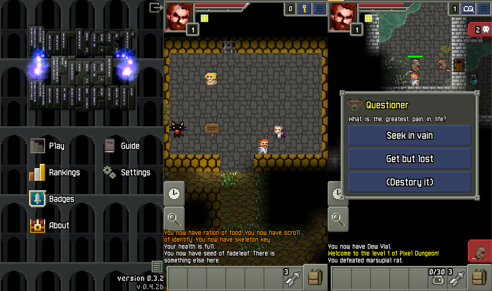
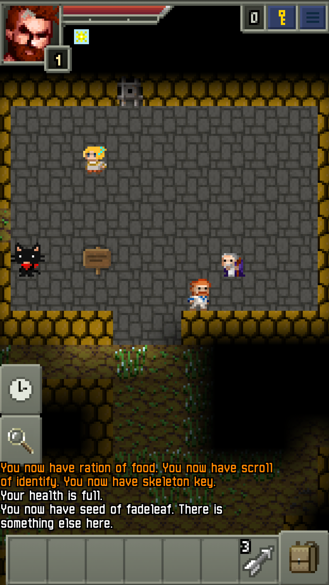
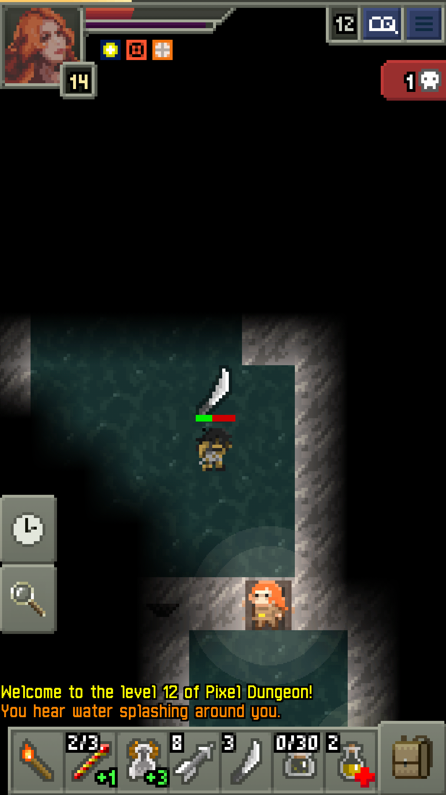
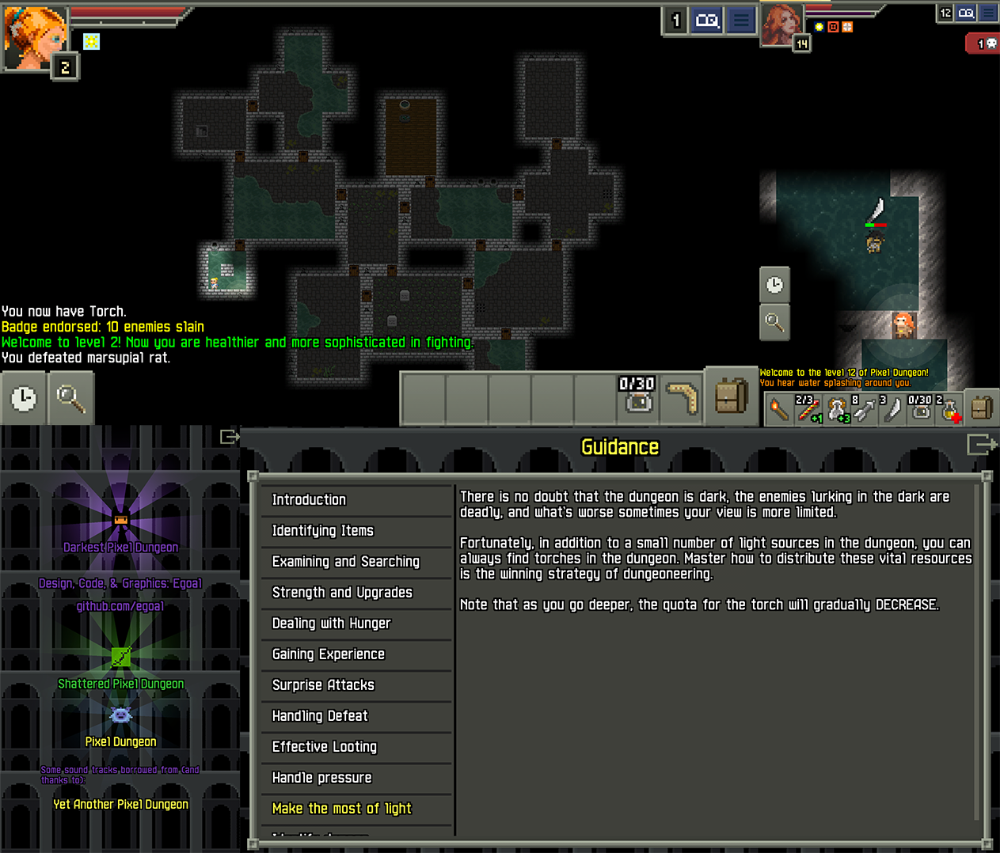
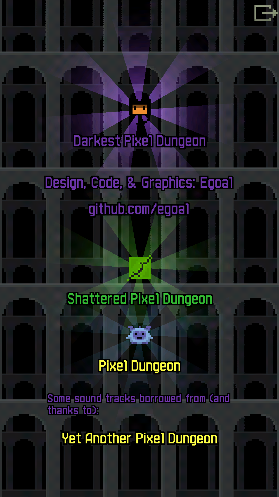
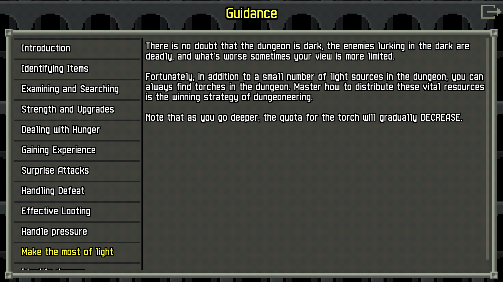

## Darkest Pixel Dungeon(dpd)

a rougelike rpg, with randomly generated levels, items, enemies, and traps. see screenshots below.

based on the source code of [pixel dungeon](https://github.com/watabou/pixel-dungeon) and [shattered pixel dungeon](https://github.com/00-Evan/shattered-pixel-dungeon)

check [darkest pixel dungeon wiki](https://pixeldungeon.fandom.com/wiki/Mod-Darkest_Pixel_Dungeon)

download [latest version](https://github.com/egoal/darkest-pixel-dungeon/releases)

help on [translation](https://www.transifex.com/darkest-pixel-dungeon-localization/)

---
current features & highlights:
* pressure system.
* perk mechanics.
* reworked damage proc.
* new hero class: Sorceress, Exile
* new enemies.
* new artifacts, equipments, and many other items.
* new npc, quests.

background sound track are from (and thanks to) [yet another pixel dungeon](https://github.com/ConsideredHamster/YetAnotherPixelDungeon)

---
develop journal (in chinese) in [dev/dev-notes](./dev/dev-notes)

feel free to contact me, english& chinese is okay.

---
screenshots:

